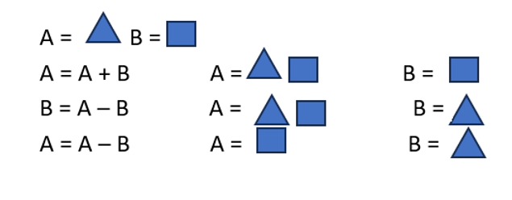

[🇺🇸 English](./README.md) | [🇮🇷 فارسی](../../fa/q001/README.md)

---
# Question 001:  Performing a swap operation between two numeric variables without a temporary (tmp) variable 

---

We have two numeric variables, and we want to swap their values without defining a temporary variable. What is your solution?
Assuming that adding the two numbers does not cause an overflow, the well-known method is as follows.
If we assume we have two variables A and B, where the value stored in A is Δ (triangle) and the value stored in B is # (square):

  

## 🤝 Contributors

| GitHub | LinkedIn | Email | Site | Telegram |
|--------|----------|-------|------|----------|
| [HadiAbbasi](https://github.com/HadiAbbasi) | [Hadi Abbasi](https://www.linkedin.com/in/hadi-abbasi-programmer/) | [Hadi Abbasi](hadi.abbasi.programmer@gmail.com) | [Hiens.org](https://hiens.org) | [Hadi Abbasi](@Hadi_Abbasi_Programmer) |

