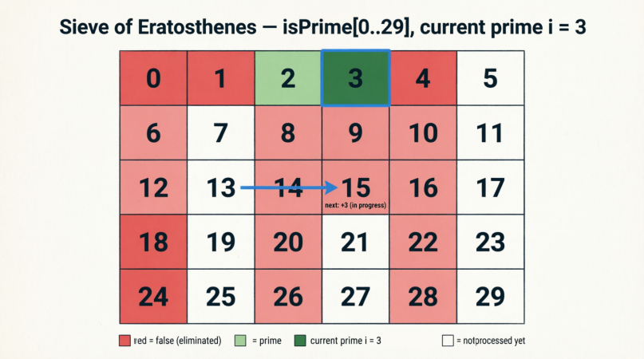

<div align="center">

[🇺🇸 English](./README.md) | [🇮🇷 فارسی](../../fa/q007/README.md)

</div>

---

# Question 007: Counting Prime Numbers Less Than `N`

## Problem Statement

The goal of this problem is to find the number of prime numbers between `1` and `N - 1`.

That means we do not check whether the number `N` itself is prime.

> Note: If we want to include `N` itself in the count, we can define the array with size `N + 1` and continue the logic based on the array length.

---

## Simple Method: `Brute Force`

The first method that comes to mind is:

1. Loop from `2` to `N - 1`.
2. For each number `i`, check whether it is divisible by any number between `2` and `i / 2`.
3. If it is not divisible, then it is a prime number.

### Why Is Checking Up to `i / 2` Enough?

Because the possible smallest divisor of a number after `1` is `2`.

If a number `N` is divisible by `2`:

```text
N = 2 × X  -->  X = N / 2
```

If it is divisible by `3`:

```text
N = 3 × Y  -->  Y = N / 3
```

As the divisor becomes larger, the corresponding quotient becomes smaller.

Therefore, no divisor can be larger than `N / 2`.

---

## Logical Implementation of the Simple Method

For each number `i`:

1. Define a boolean variable named `is_prime`.
2. Assume that `i` is prime.
3. In an inner loop, move from `2` to `i / 2`.
4. If `i % j == 0`:
   - Set `is_prime` to `false`.
   - Stop checking that number.
5. If no divisor is found until the end of the inner loop:
   - `i` is a prime number.
   - Increase the prime counter by one.

---

## Optimized Method: Sieve of Eratosthenes

This method is the famous `Sieve of Eratosthenes` algorithm.

### Main Idea

Instead of searching for prime numbers, we eliminate non-prime numbers.

Steps:

1. Consider a boolean table, or array, from `0` to `N` or `N - 1`.

   Index `0` represents number `0`, index `1` represents number `1`, index `2` represents number `2`, and so on.

   From now on, when we say we eliminate a number, we mean setting its index to `false`.

   The name of this boolean array is `Is_Prime`.

   - If an index is `true`, it means that number is prime.
   - If an index is `false`, it means that number is not prime.

   Eliminating a number means setting its index to `false`, which means it is not prime.

   Initially, all elements of this array are `true`, meaning we assume all numbers are prime.

   When we prove that a number is not prime, we set its index to `false`.

2. Eliminate `0` and `1`, because they are not prime.

3. Start from number `2`.

4. Since `2` has not been eliminated, we consider it prime.

5. Then eliminate its multiples:

```text
2 × 2
3 × 2
4 × 2
... until the end of the array
```

6. Then move to the next number, `3`.

7. If `3` has not been eliminated, we consider it prime.

8. Then eliminate its multiples.

9. Continue this process until all non-prime numbers are eliminated.

However, if we continue this process until the last element of the array, we spend more time than necessary. It is not really required to repeat this process all the way to the last element.

---

### Optimization 1: Why Start Eliminating Multiples from `i × i`?

When we reach number `3`:

```text
3 × 2 = 6
```

The number `6` has already been eliminated as a multiple of `2`.

So, to avoid repetition, we start eliminating multiples of each number from:

```text
i × i
```

Because:

```text
i × (i - 1)
```

has already been eliminated in the previous step for `i - 1`.

---

### General Rule of the Sieve Algorithm

1. If a number has already been eliminated, we do not check its multiples again.
2. Eliminating multiples of each number starts from `i × i`.
3. We continue this process while:

```text
i × i < N
```

Because if `i × i` becomes greater than `N`, there is no new multiple inside the valid range.

More precisely, when we conclude that multiples should be eliminated starting from `i * i`, if `i * i` is greater than `N`, then it is outside our computation range. Therefore, we do not compute that number or larger numbers, because their multiples are outside the array range.

---

<div align="center">
  
</div>

---

## Final Implementation in `C++`

```cpp
#include <vector>
#include <algorithm>
using namespace std;

int countPrimes(int n) {
    if (n <= 2) {
        return 0;
    }

    vector<bool> isPrime(n, true);

    isPrime[0] = false;
    isPrime[1] = false;

    for (int i = 2; i * i < n; i++) {
        if (isPrime[i]) {
            for (int j = i * i; j < n; j += i) {
                isPrime[j] = false;
            }
        }
    }

    return count(isPrime.begin(), isPrime.end(), true);
}
```

---

## Short Code Explanation

1. If `n <= 2`, there is no prime number less than it.
2. We create a boolean array of size `n`.
3. Initially, we set all elements to `true`.
4. We set index `0` and index `1` to `false`.
5. We start from number `2`.
6. If the current number is prime, we eliminate its multiples starting from `i * i`.
7. At the end, we count the number of elements that are still `true`.

---

## Time Complexity Summary

| Method | Time Complexity | Explanation |
| --- | --- | --- |
| Simple Method | `O(N^2)` | For each number, we check many divisors |
| Sieve of Eratosthenes | `O(N log log N)` | We eliminate multiples of prime numbers |

For large values of `N`, the sieve algorithm is much faster and more efficient.

---

## Free Study: Intuitive Understanding of the Sieve

The sieve method can be imagined like this:

1. Write numbers from `0` to `N` in a table.
2. Cross out `0` and `1`, because they are not prime.
3. Start from number `2`.
4. Since `2` has not been crossed out, consider it prime.
5. Then cross out all multiples of `2`:

```text
2 × 2
3 × 2
4 × 2
...
```

6. Then move to number `3`.
7. Since `3` has not been crossed out, consider it prime.
8. Now we want to cross out multiples of `3`.

But:

```text
2 × 3 = 6
```

has already been crossed out as a multiple of `2`.

So we start from:

```text
3 × 3
```

Similarly, for number `5`, we start from:

```text
5 × 5
```

Because:

```text
5 × 2
```

has already been eliminated as a multiple of `2`.

Also:

```text
5 × 3
```

has already been eliminated as a multiple of `3`.

---

## Important Logical Note

If a number like `X` is the product of two numbers:

```text
A × B = X
```

and if we have already eliminated the multiples of `A`, then `X` and its multiples have also already been eliminated.

For example:

```text
A × B = X
2 × A × B = 2 × X
3 × A × B = 3 × X
...
```

So if an index has already become `false`, we do not need to check that number or its multiples again.

---

## 🤝 Contributors

<div align="center">

| GitHub | LinkedIn | Email | Site | Telegram |
|--------|----------|-------|------|----------|
| [HadiAbbasi](https://github.com/HadiAbbasi) | [Hadi Abbasi](https://www.linkedin.com/in/hadi-abbasi-programmer/) | [Hadi Abbasi](hadi.abbasi.programmer@gmail.com) | [Hiens.org](https://hiens.org) | [Hadi Abbasi](@Hadi_Abbasi_Programmer) |

</div>