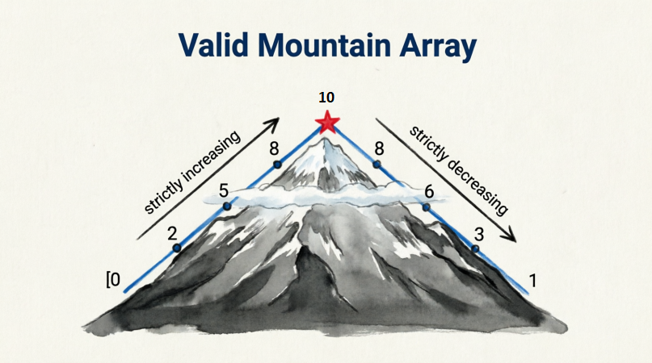

<div align="center">

[🇺🇸 English](./README.md) | [🇮🇷 فارسی](../../fa/q010/README.md)

</div>

---

# Question 010: Google Array Question Valid mountain array Easy

<div align="center">
  
</div>

Question: You are given an array of integers and asked to determine whether the array forms a mountain from the first element to the last.

In other words, the numbers must be strictly increasing from the beginning up to some point, and then strictly decreasing from that point to the end.

```
class Solution {
public:
    bool validMountainArray(vector<int>& A) {
        int i = 1;

        while (i < A.size() && A[i] > A[i - 1]) {
            i++;
        }

        if (i == 1 || i == A.size()) {
            return false;
        }

        while (i < A.size() && A[i] < A[i - 1]) {
            i++;
        }

        return i == A.size();
    }
};
```

---

## 🤝 مشارکت کنندگان

<div align="center">

| GitHub | LinkedIn | Email | Site | Telegram |
|--------|----------|-------|------|----------|
| [HadiAbbasi](https://github.com/HadiAbbasi) | [Hadi Abbasi](https://www.linkedin.com/in/hadi-abbasi-programmer/) | [Hadi Abbasi](hadi.abbasi.programmer@gmail.com) | [Hiens.org](https://hiens.org) | [Hadi Abbasi](@Hadi_Abbasi_Programmer) |

</div>