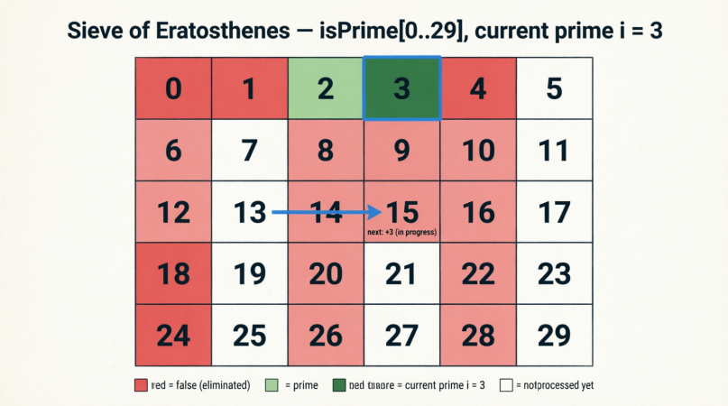

<div align="right">

[🇺🇸 English](../../en/q007/README.md) | [🇮🇷 فارسی](./README.md)

</div>

# سوال ۰۰۷: شمارش اعداد اول کوچک‌تر از `N`

## صورت مسئله

هدف این مسئله این است که تعداد اعداد اول بین `1` تا `N - 1` را پیدا کنیم.

یعنی خود عدد `N` را بررسی نمی‌کنیم که اول است یا نه.

> نکته: اگر بخواهیم خود `N` را هم در شمارش شامل کنیم، کافی است آرایه را با اندازه `N + 1` تعریف کنیم و منطق را بر اساس طول آرایه ادامه دهیم.

---

## روش ساده: `Brute Force`

اولین روشی که به ذهن می‌رسد این است که:

1. از عدد `2` تا `N - 1` حلقه بزنیم.
2. برای هر عدد `i` بررسی کنیم که آیا بر عددی بین `2` تا `i / 2` بخش‌پذیر است یا نه.
3. اگر بخش‌پذیر نبود، آن عدد اول است.

### چرا بررسی تا `i / 2` کافی است؟

چون کوچک‌ترین مقسوم‌علیه یک عدد بعد از `1`، عدد `2` است.

اگر عدد `N` بر `2` بخش‌پذیر باشد:

```text
N = 2 × X  -->  X = N / 2
```

اگر بر `3` بخش‌پذیر باشد:

```text
N = 3 × Y  -->  Y = N / 3
```

هرچه مقسوم‌علیه بزرگ‌تر شود، ضریب مقابل آن کوچک‌تر می‌شود.

بنابراین هیچ مقسوم‌علیه‌ای نمی‌تواند بزرگ‌تر از `N / 2` باشد.

---

## پیاده‌سازی منطقی روش ساده

برای هر عدد `i`:

1. یک متغیر بولین به نام `is_prime` تعریف می‌کنیم.
2. فرض می‌کنیم `i` اول است.
3. در یک حلقه داخلی، از `2` تا `i / 2` حرکت می‌کنیم.
4. اگر `i % j == 0` شد:
   - آنوقت `is_prime` را `false` می‌کنیم.
   - بررسی آن عدد را متوقف می‌کنیم.
5. اگر تا پایان حلقه داخلی هیچ مقسوم‌علیه‌ای پیدا نشد:
   - آنوقت `i` یک عدد اول است.
   - شمارنده اعداد اول را یک واحد افزایش می‌دهیم.

---

## روش بهینه: غربال اراتوستن

این روش همان الگوریتم معروف `Sieve of Eratosthenes` است.

### ایده اصلی

به جای اینکه دنبال اعداد اول بگردیم، اعداد غیراول را حذف می‌کنیم.

مراحل:

1. یک جدول (آرایه) بولین از `0` تا `N` یا `N - 1` در نظر می‌گیریم. اندیس 0 نماینده عدد 0 و اندیس 1 نماینده عدد 1 و اندیس 2 نماینده عدد 2 و .... هستند! ازاین به بعد، وقتی می گوییم عدد فلان را حذف می کنیم، یعنی اندیس آن عدد را برابر false می کنیم. نام این آرایه بولین Is_Prime است و true بودن یک اندیس در آن یعنی آن عدد یک عدد اول است و false بودنش هم یعنی آن عدد اول نیست! حذف کردن یک عدد یعنی اندیس آنرا برابر false کن که یعنی اول نیست! در ابتدا تمام خانه های این آرایه، true یعنی اول هستند! با اثبات اینکه هر عدد، یک عدد اول نیست، آن اندیس از آرایه را false خواهیم کرد!2. عدد `0` و عدد `1` را حذف می‌کنیم، چون اول نیستند.
3. از عدد `2` شروع می‌کنیم.
4. چون عدد `2` هنوز حذف نشده، آن را اول در نظر می‌گیریم.
5. سپس مضارب آن را حذف می‌کنیم:

```text
2 × 2
3 × 2
4 × 2
... تا آخر آرایه
```

6. سپس به عدد بعدی یعنی `3` می‌رویم.
7. اگر `3` هنوز حذف نشده بود، آن را اول در نظر می‌گیریم.
8. سپس مضارب آن را حذف می‌کنیم.

---

و همین رویه را ادامه می دهیم تا اینکه تمام اعداد غیر اول حذف شوند! اما اگر این رویه را تا آخرین خانه آرایه ادامه دهیم، زمان کمی زمان بیشتری را صرف کرده ایم و واقعا لازم نیست این کار را تا آخرین خانه آرایه تکرار کنیم.

## بهینه سازی 1: چرا حذف مضارب را از `i × i` شروع می‌کنیم؟

وقتی به عدد `3` می‌رسیم:

```text
3 × 2 = 6
```

عدد `6` قبلاً به عنوان مضرب عدد `2` حذف شده است.

پس برای جلوگیری از تکرار، حذف مضارب هر عدد را از:

```text
i × i
```

شروع می‌کنیم.

زیرا:

```text
i × (i - 1)
```

قبلاً در مرحله `i - 1` حذف شده است.

---

## قانون کلی الگوریتم غربال

1. اگر عددی قبلاً حذف شده باشد، دیگر مضارب آن را بررسی نمی‌کنیم.
2. حذف مضارب هر عدد از `i × i` شروع می‌شود.
3. این کار را تا زمانی ادامه می‌دهیم که:

```text
i × i < N
```

زیرا اگر `i × i` از `N` بزرگ‌تر شود، دیگر مضرب جدیدی داخل محدوده نداریم. به بیان بهتر وقتی برای هر عدد نتیجه می گیریم که باید مضارب را از `i * i` شروع به حذف کنیم، اگر قرار باشد مضرب `i * i` بزرگتر از N باشد، چون بیرون از دایره محاسبات ما است، آن عدد و اعداد بزرگتر از آنرا محاسبه نمی کنیم و مضارب آن خارج از محدوده آرایه است!

---

<div align="center">
  
</div>

---

## پیاده‌سازی نهایی به زبان `C++`

```cpp
#include <vector>
#include <algorithm>
using namespace std;

int countPrimes(int n) {
    if (n <= 2) {
        return 0;
    }

    vector<bool> isPrime(n, true);

    isPrime[0] = false;
    isPrime[1] = false;

    for (int i = 2; i * i < n; i++) {
        if (isPrime[i]) {
            for (int j = i * i; j < n; j += i) {
                isPrime[j] = false;
            }
        }
    }

    return count(isPrime.begin(), isPrime.end(), true);
}
```

---

## توضیح کوتاه کد

1. اگر `n <= 2` باشد، هیچ عدد اول کوچک‌تر از آن وجود ندارد.
2. یک آرایه بولین به اندازه `n` می‌سازیم.
3. در ابتدا همه خانه‌ها را `true` قرار می‌دهیم.
4. خانه `0` و `1` را `false` می‌کنیم.
5. از عدد `2` شروع می‌کنیم.
6. اگر عدد فعلی اول بود، مضارب آن را از `i * i` به بعد حذف می‌کنیم.
7. در پایان تعداد خانه‌های `true` را می‌شماریم.

---

## جمع‌بندی پیچیدگی زمانی

| روش | پیچیدگی زمانی | توضیح |
| --- | --- | --- |
| روش ساده | `O(N^2)` | برای هر عدد، بررسی تعداد زیادی از مقسوم‌علیه‌ها |
| غربال اراتوستن | `O(N log log N)` | حذف کردن مضارب اعداد اول |

برای مقادیر بزرگ `N`، الگوریتم غربال بسیار سریع‌تر و بهینه‌تر است.

---

## مطالعه آزاد: درک شهودی غربال

روش غربال را می‌توان این‌گونه تصور کرد:

1. اعداد `0` تا `N` را در یک جدول می‌نویسیم.
2. عدد `0` و `1` را خط می‌زنیم، چون اول نیستند.
3. از عدد `2` شروع می‌کنیم.
4. چون `2` خط نخورده است، آن را اول در نظر می‌گیریم.
5. سپس تمام مضارب `2` را خط می‌زنیم:

```text
2 × 2
3 × 2
4 × 2
...
```

6. سپس به عدد `3` می‌رسیم.
7. چون `3` هنوز خط نخورده است، آن را اول در نظر می‌گیریم.
8. حالا می‌خواهیم مضارب `3` را خط بزنیم.

اما:

```text
2 × 3 = 6
```

قبلاً به عنوان مضرب عدد `2` خط خورده است.

پس از:

```text
3 × 3
```

شروع می‌کنیم.

به همین شکل برای عدد `5` نیز از:

```text
5 × 5
```

شروع می‌کنیم، زیرا:

```text
5 × 2
```

قبلاً به عنوان مضرب عدد `2` حذف شده است.

همچنین:

```text
5 × 3
```

قبلاً به عنوان مضرب عدد `3` حذف شده است.

---

## نکته مهم منطقی

اگر عددی مانند `X` حاصل ضرب دو عدد باشد:

```text
A × B = X
```

و اگر قبلاً مضارب `A` را حذف کرده باشیم، خود `X` و مضارب آن نیز قبلاً حذف شده‌اند.

مثلاً:

```text
A × B = X
2 × A × B = 2 × X
3 × A × B = 3 × X
...
```

پس اگر خانه‌ای قبلاً `false` شده باشد، دیگر نیازی نیست خود آن یا مضاربش را بررسی کنیم.

---

## 🤝 مشارکت کنندگان

<div align="center">

| GitHub | LinkedIn | Email | Site | Telegram |
|--------|----------|-------|------|----------|
| [HadiAbbasi](https://github.com/HadiAbbasi) | [Hadi Abbasi](https://www.linkedin.com/in/hadi-abbasi-programmer/) | [Hadi Abbasi](hadi.abbasi.programmer@gmail.com) | [Hiens.org](https://hiens.org) | [Hadi Abbasi](@Hadi_Abbasi_Programmer) |

</div>