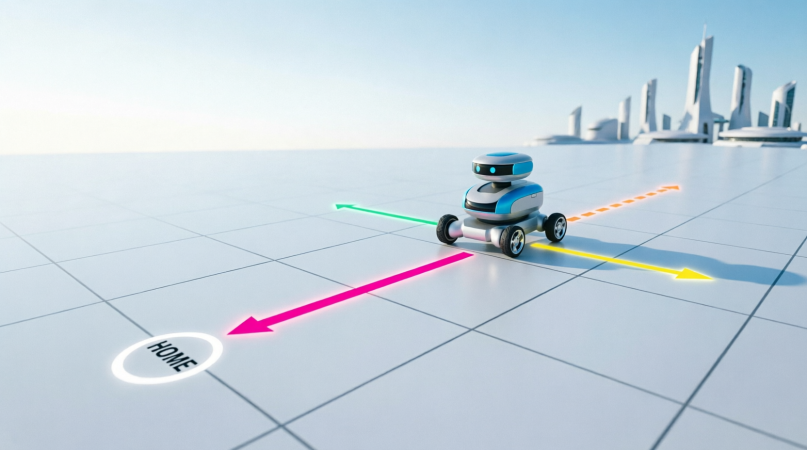

<div align="right">

[🇺🇸 English](../../en/q008/README.md) | [🇮🇷 فارسی](./README.md)

</div>

---

# سوال 008:  (سوال آمازون) بازگشت ربات به مبدا حرکت

<div align="center">
  
</div>

# مسئله‌ی Robot Return to Origin

## صورت مسئله چیست؟

فرض کنید یک ربات روی یک صفحه‌ی دوبعدی قرار دارد. ربات از نقطه‌ی شروع، یعنی مختصات `(0, 0)`، حرکتش را آغاز می‌کند.

به ربات یک رشته از حروف داده می‌شود که هر حرف نشان‌دهنده‌ی یک حرکت است:

* `U` → یک خانه به بالا (Up)
* `D` → یک خانه به پایین (Down)
* `L` → یک خانه به چپ (Left)
* `R` → یک خانه به راست (Right)

مثلاً اگر ورودی این باشد:

```text
"UDLR"
```

ربات ابتدا بالا می‌رود، سپس پایین می‌آید، بعد به چپ و در نهایت به راست می‌رود.

در پایان باید مشخص کنیم:

> آیا ربات دوباره به نقطه‌ی شروع `(0, 0)` برگشته است یا نه؟

---

## ایده‌ی اصلی حل

برای حل مسئله نیازی به ساختن یک صفحه یا نگه‌داشتن تمام مسیر نداریم.

فقط کافی است **موقعیت فعلی ربات** را با دو عدد `x` و `y` نگه داریم.

ابتدا:

```cpp
int x = 0;
int y = 0;
```

هر حرکت موقعیت یکی از این دو مختصات را تغییر می‌دهد.

### حرکت به بالا — `U`

مختصات `y` یک واحد زیاد می‌شود:

```cpp
y += 1;
```

### حرکت به پایین — `D`

مختصات `y` یک واحد کم می‌شود:

```cpp
y -= 1;
```

### حرکت به راست — `R`

مختصات `x` یک واحد زیاد می‌شود:

```cpp
x += 1;
```

### حرکت به چپ — `L`

مختصات `x` یک واحد کم می‌شود:

```cpp
x -= 1;
```

در نهایت اگر:

```cpp
x == 0 && y == 0;
```

باشد، یعنی ربات دقیقاً به نقطه‌ی شروع برگشته است.

---

## یک مثال ساده

فرض کنید ورودی:

```text
"UD"
```

باشد.

ربات از `(0, 0)` شروع می‌کند.

حرکت `U`:

```text
(0, 0) → (0, 1)
```

حرکت `D`:

```text
(0, 1) → (0, 0)
```

پس در پایان دوباره به `(0, 0)` رسیده است.

بنابراین جواب:

```text
true
```

است.

---

## یک مثال دیگر

فرض کنید ورودی:

```text
"LLRR"
```

باشد.

مسیر ربات:

```text
شروع: (0, 0)

L → (-1, 0)

L → (-2, 0)

R → (-1, 0)

R → (0, 0)
```

پس ربات دوباره به نقطه‌ی شروع برگشته است.

جواب:

```text
true
```

---

## چه زمانی جواب `false` می‌شود؟

فرض کنید ورودی:

```text
"UUR"
```

باشد.

حرکت‌ها:

```text
(0, 0)
   ↓ U
(0, 1)
   ↓ U
(0, 2)
   ↓ R
(1, 2)
```

ربات در `(1, 2)` قرار دارد، نه `(0, 0)`.

بنابراین:

```text
false
```

---

# نکته‌ی مهم مسئله

در واقع لازم نیست مسیر واقعی ربات را ذخیره کنیم.

مثلاً نیازی نیست چیزی شبیه این داشته باشیم:

```text
[(0,0), (0,1), (0,2), (1,2)]
```

چون تنها چیزی که برای جواب نهایی اهمیت دارد، **موقعیت نهایی** است.

بنابراین یک روش بسیار ساده داریم:

1. `x` و `y` را صفر کن.
2. تک‌تک کاراکترهای رشته را بخوان.
3. بر اساس کاراکتر، `x` یا `y` را تغییر بده.
4. در پایان بررسی کن آیا `x` و `y` هر دو صفر هستند یا نه.

---

# نکته‌ی جالب‌تر: حتی می‌توانیم بدون شبیه‌سازی کامل فکر کنیم

برای اینکه ربات به نقطه‌ی شروع برگردد، باید تعداد حرکت‌های بالا و پایین با هم برابر باشد.

یعنی:

```text
تعداد U = تعداد D
```

و همچنین تعداد حرکت‌های چپ و راست باید برابر باشد:

```text
تعداد L = تعداد R
```

مثلاً:

```text
"UUDDLLRR"
```

دو حرکت `U` و دو حرکت `D` داریم.

همچنین دو حرکت `L` و دو حرکت `R` داریم.

پس ربات به نقطه‌ی شروع برمی‌گردد.

اما در مصاحبه‌ی فنی، روش `x` و `y` معمولاً روش تمیزتر و قابل‌فهم‌تری است، چون مستقیماً موقعیت ربات را شبیه‌سازی می‌کنیم.

---

# پیچیدگی زمانی

فرض کنیم طول رشته `n` باشد.

ما هر کاراکتر را دقیقاً یک بار بررسی می‌کنیم.

بنابراین:

```text
Time Complexity: O(n)
```

و فقط دو متغیر `x` و `y` نگه می‌داریم:

```text
Space Complexity: O(1)
```

یعنی حافظه‌ی اضافی ثابت است و به اندازه‌ی رشته وابسته نیست.

---

# پیاده‌سازی ساده

مثلاً در C++:

```cpp
#include <string>
using namespace std;

bool judgeCircle(string moves) {
    int x = 0;
    int y = 0;

    for (char move : moves) {
        if (move == 'U') {
            y += 1;
        }
        else if (move == 'D') {
            y -= 1;
        }
        else if (move == 'R') {
            x += 1;
        }
        else if (move == 'L') {
            x -= 1;
        }
    }

    return x == 0 && y == 0;
}
```

مثلاً:

```cpp
std::cout<<judgeCircle("UDLR");
```

خروجی:

```text
True
```

---

## 🤝 مشارکت کنندگان

<div align="center">

| GitHub | LinkedIn | Email | Site | Telegram |
|--------|----------|-------|------|----------|
| [HadiAbbasi](https://github.com/HadiAbbasi) | [Hadi Abbasi](https://www.linkedin.com/in/hadi-abbasi-programmer/) | [Hadi Abbasi](hadi.abbasi.programmer@gmail.com) | [Hiens.org](https://hiens.org) | [Hadi Abbasi](@Hadi_Abbasi_Programmer) |

</div>