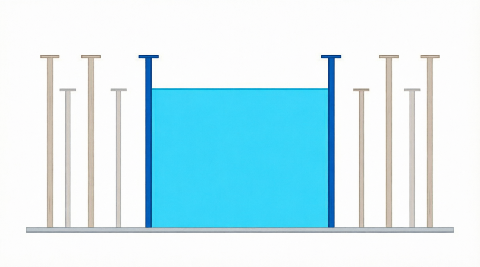

<div align="center">

[🇺🇸 English](../../en/q009/README.md) | [🇮🇷 فارسی](./README.md)

</div>

---

# سوال 009:  (سوال مایکروسافت): آرایه ستون ها و دو ستون با بیشترین آب میانشان

<div align="center">
  
</div>

فرض کنید یک سری خط عمودی با ارتفاع‌های مختلف داریم که روی یک خط افقی قرار گرفته‌اند. مثلاً:

```
        |
        |       |
        |       |       |
        |       |       |
    |   |       |       |
    |   |       |       |
    |   |   |   |       |
-----------------------------
```

هر دو خط را که انتخاب کنیم، اگر بینشان آب بریزیم، یک ظرف درست می‌شود.

هدف سؤال چیست؟

باید دو خط را پیدا کنیم که بتوانند بیشترین مقدار آب را بین خودشان نگه دارند.

نکته مهم این است که:

فاصله بین دو خط مهم است. هر چه فاصله بیشتر باشد، آب بیشتری نگه می دارند!
ارتفاع کوتاه‌ترِ دو خط تعیین می‌کند آب تا چه ارتفاعی می‌تواند بالا بیاید.

مثلاً اگر  خطور زیر را داشته باشیم:

```
|           |
|           |
|           |
|           |
|           |
|     |     |
|     |     |
------------
```

اگر ارتفاع خط اول 5 و خط دوم 3 باشد، آب نمی‌تواند بیشتر از ارتفاع 3 بالا بیاید. چون آب بیشتر از ارتفاع ستون کوتاهتر، از اطراف آن سرریز می شود!

پس مقدار آب تقریباً این است:

فاصله بین دو خط × ارتفاع خط کوتاه‌تر

یعنی:

```
Area = width × min(height1, height2)
```

## خلاصه در یک جمله:

از بین تمام جفت خط‌ها، دو خطی را پیدا کنید که بینشان بتوانیم بیشترین مقدار آب نگه داریم.

## روش حل بهینه:

از دو طرف ستون ها شروع می کنیم و میزان آب قابل جمع شدن بین دو ستون را محاسبه می کنیم و با متغیر موقت بیشترین مقدار آب نگهداری شده بین دو ستون مقایسه می کنیم و اگر عدد میزان آب جمع آوری شده جدید، بیشتر از مقدار آن باشد، مقدار آنرا به مقدار جدید override می کنیم وبازه را از سمت ستون کوتاه تر تنگ تر می کنیم!
چرا بازه را از سمت ستون کوتاه تر تنگ می کنیم؟ چون همان طور که فهمیدید، ستون کوتاهتر باعث کاهش میزان حجم آب نگه داری شده بین دو ستون می شود و لذا از سمت آن، بازه را تنگ تر می کنیم تا شاید به ستون بلندتری دست پیدا کنیم که باعث افزایش میزان نگه داری شدن حجم آب شود! به بیان بهتر ما شرایط بهتر را از اصلاح طرفی که باعث نقص بیشتر می شود، ادامه می دهیم و در اینجا یافتن ستونی بلندتر از ستون کوتاه تر می تواند باعث یافتن بیشترین میزان حجم آب قابل نگهداری بین دو ستون باشد!
حتی با کاهش فاصله ستونها؟ بله! حتی اگر دو ستون کوتاه به ارتفاغ 1 در فاصله 20 واحدی از هم باشند، مساحت حجم آب قابل نگه داری برابر 1 * 20 = 20 می شود!
در صورتیکه دو ستون 40 واحدی حتی در فاصله 1 واحدی از هم، به اندازه مساحت 40 واحدی آب در بین خود نگه می دارند!
الگریتم حل این مساله:

```
#include <iostream>
#include <vector>
#include <algorithm>
using namespace std;

class Solution {
public:
    int maxArea(vector<int>& height) {
        int left = 0;
        int right = height.size() - 1;
        int maxArea = 0;

        while (left < right) {
            // عرض ظرف
            int width = right - left;

            // ارتفاع ظرف = ارتفاع کوتاه‌تر
            int h = min(height[left], height[right]);

            // مساحت
            int area = width * h;

            // بیشترین مساحت
            maxArea = max(maxArea, area);

            // حرکت دادن اشاره‌گر خط کوتاه‌تر
            if (height[left] < height[right]) {
                left++;
            } else {
                right--;
            }
        }

        return maxArea;
    }
};

int main() {
    Solution solution;

    vector<int> height = {1, 8, 6, 2, 5, 4, 8, 3, 7};

    cout << solution.maxArea(height) << endl;

    return 0;
}

```

---

## 🤝 مشارکت کنندگان

<div align="center">

| GitHub | LinkedIn | Email | Site | Telegram |
|--------|----------|-------|------|----------|
| [HadiAbbasi](https://github.com/HadiAbbasi) | [Hadi Abbasi](https://www.linkedin.com/in/hadi-abbasi-programmer/) | [Hadi Abbasi](hadi.abbasi.programmer@gmail.com) | [Hiens.org](https://hiens.org) | [Hadi Abbasi](@Hadi_Abbasi_Programmer) |

</div>