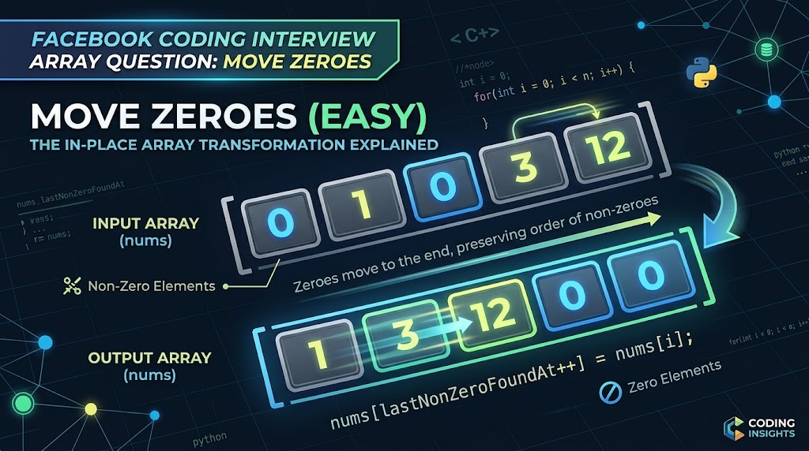

<div align="center">

[🇺🇸 English](../../en/q011/README.md) | [🇮🇷 فارسی](./README.md)

</div>

---
# سوال 011:  (سوال فیسبوک) انتقال صفرهای آرایه به انتها

<div align="center">
  
</div>

## راهنمای جامع حل مسئله Move Zeroes (سوال مصاحبه فیس‌بوک/متا)

مسئله **Move Zeroes** یکی از پرکاربردترین سوالات سطح Easy در پلتفرم LeetCode و الگوی تکرارشونده در مصاحبه‌های شرکت‌های بزرگ تکنولوژی نظیر Meta (Facebook) است. این مسئله مفهوم پیمایش آرایه‌ها و مدیریت حافظه درجا (In-place) را ارزیابی می‌کند.

---

### ۱. صورت مسئله

یک آرایه از اعداد صحیح به نام `nums` به شما داده شده است. هدف این است که تمام مقادیر `0` را به انتهای آرایه منتقل کنید، به طوری که:

* ترتیب نسبی عناصر غیرصفر حفظ شود.
* تغییرات حتماً **درجا (In-place)** انجام شود (بدون کپی کردن آرایه یا ساخت آرایه جدید).

**مثال ورودی و خروجی:**

| ورودی | خروجی |
| --- | --- |
| `[0, 1, 0, 3, 12]` | `[1, 3, 12, 0, 0]` |
| `[0]` | `[0]` |

---

### ۲. استراتژی حل (روش دو اشاره‌گر - Two Pointers)

روش ساده اما نادرست این است که یک آرایه جدید بپذیریم و غیرصفرها را درون آن بریزیم؛ اما این کار شرط حافظه درجا را نقض می‌کند.

بهترین راهکار استفاده از الگوریتم **دو اشاره‌گر** در یک پیمایش (Single Pass) است:

1. **اشاره‌گر اول (`lastNonZeroFoundAt`):** مقصدی را پیگیری می‌کند که عنصر غیرصفر بعدی باید در آنجا قرار گیرد.
2. **اشاره‌گر دوم (`i`):** کل آرایه را از ابتدا تا انتها پیمایش می‌کند.

در هر مرحله، اگر عنصر فعلی (`nums[i]`) مخالف صفر بود، جای آن را با خانه `lastNonZeroFoundAt` تعویض (Swap) کرده و سپس `lastNonZeroFoundAt` را یک واحد به جلو می‌بریم. با این الگوریتم، تمام صفرها بدون نیاز به حلقه دوم به انتهای آرایه رانده می‌شوند.

---

### ۳. پیاده‌سازی به زبان ++C

```cpp
#include <iostream>
#include <vector>
#include <algorithm>

using namespace std;

class Solution {
public:
    void moveZeroes(vector<int>& nums) {
        // اشاره‌گر برای ثبت موقعیت قرارگیری عنصر غیرصفر بعدی
        int lastNonZeroFoundAt = 0;
        
        // پیمایش یک‌باره آرایه
        for (int i = 0; i < nums.size(); i++) {
            if (nums[i] != 0) {
                // جابه‌جایی عنصر غیرصفر به اولین موقعیت خالی در سمت چپ
                swap(nums[lastNonZeroFoundAt], nums[i]);
                lastNonZeroFoundAt++;
            }
        }
    }
};

```

توضیح اضافه برای کسانی که هنوز روش حل مساله را درک نکرده اند:

برای درک شهودی و ملموس الگوریتم Move Zeroes، می‌توانید یک صف از جعبه‌ها را تصور کنید که برخی حاوی هدایا (اعداد غیرصفر) و برخی دیگر خالی (اعداد صفر) هستند.

**نقش‌های اصلی در این روش**

* **کاوشگر (اشاره‌گر اول):** خانه به خانه از ابتدا تا انتهای صف را پیمایش کرده و محتوای هر جعبه را بررسی می‌کند.
* **جمع‌آوری‌کننده (اشاره‌گر دوم):** در انتظار باقی می‌ماند تا نخستین جایگاه خالی جهت دریافت هدیه را مشخص کند.

**قوانین نحوه عملکرد**

* **اگر کاوشگر جعبه خالی (صفر) مشاهده کند:** هیچ اقدامی انجام نمی‌دهد؛ خودش یک گام به جلو می‌رود، اما **جمع‌آوری‌کننده در جایگاه خود باقی می‌ماند** (زیرا دقیقاً روی یک خانه صفر قرار گرفته و منتظر دریافت هدیه است).
* **اگر کاوشگر هدیه‌ای (عدد غیرصفر) مشاهده کند:** هدیه را با جعبه‌ای که **جمع‌آوری‌کننده** روی آن ایستاده است جابه‌جا (Swap) می‌کند؛ سپس **جمع‌آوری‌کننده یک گام به جلو حرکت می‌کند**.

**اجرای قدم‌به‌قدم روی یک مثال**

آرایه اولیه: `[0, 1, 0, 3]`

| گام | عملکرد کاوشگر | وضعیت آرایه | وضعیت جمع‌آوری‌کننده |
| --- | --- | --- | --- |
| **شروع** | روی خانه اول قرار دارد | `[0, 1, 0, 3]` | روی خانه اول (اندیس 0) |
| **۱** | مقدار صفر را مشاهده کرد؛ عبور می‌کند | `[0, 1, 0, 3]` | در جایگاه خود (خانه اول) باقی می‌ماند |
| **۲** | مقدار `1` را مشاهده کرد؛ جابه‌جایی با خانه جمع‌آوری‌کننده | `[1, 0, 0, 3]` | یک گام به جلو می‌رود (خانه دوم) |
| **۳** | مقدار صفر را مشاهده کرد؛ عبور می‌کند | `[1, 0, 0, 3]` | در جایگاه خود (خانه دوم) باقی می‌ماند |
| **۴** | مقدار `3` را مشاهده کرد؛ جابه‌جایی با خانه جمع‌آوری‌کننده | `[1, 3, 0, 0]` | یک گام به جلو می‌رود |

در این فرآیند، جمع‌آوری‌کننده همواره روی **نخستین خانه صفرِ بلاتکلیف** کمین می‌کند تا به محض آنکه کاوشگر یک عدد غیرصفر کشف کرد، جایگاه آن‌ها تعویض شده و تمام اعداد غیرصفر به سمت چپ آرایه هدایت شوند.

---

### ۴. تحلیل پیچیدگی (Complexity Analysis)

* **پیچیدگی زمانی (Time Complexity):** برابر با $O(n)$ است؛ زیرا آرایه تنها یک بار پیمایش می‌شود ($n$ تعداد عناصر آرایه است).
* **پیچیدگی فضایی (Space Complexity):** برابر با $O(1)$ است؛ زیرا هیچ حافظه اضافی اختصاص داده نشده و جابه‌جایی‌ها تماماً درجا انجام می‌شوند.

---

## اگر بخواهیم صفر ها را به ابتدای آرایه بیاوریم چه؟ 

برای انتقال صفرها به ابتدای آرایه همراه با حفظ ترتیب نسبی اعداد غیرصفر، باید جهت پیمایش و چیدمان را معکوس کنید؛ یعنی از انتها به ابتدا (راست به چپ) پیمایش کنید و اعداد غیرصفر را به سمت راست بفرستید:
```
#include <iostream>
#include <vector>
#include <algorithm>

using namespace std;

class Solution {
public:
    void moveZeroesToFront(vector<int>& nums) {
        // اشاره‌گر برای ثبت موقعیت قرارگیری عنصر غیرصفر بعدی از سمت راست
        int lastNonZeroFoundAt = nums.size() - 1;
        
        // پیمایش از راست به چپ
        for (int i = nums.size() - 1; i >= 0; i--) {
            if (nums[i] != 0) {
                swap(nums[lastNonZeroFoundAt], nums[i]);
                lastNonZeroFoundAt--;
            }
        }
    }
};
```
---

## 🤝 مشارکت کنندگان

<div align="center">

| GitHub | LinkedIn | Email | Site | Telegram |
|--------|----------|-------|------|----------|
| [HadiAbbasi](https://github.com/HadiAbbasi) | [Hadi Abbasi](https://www.linkedin.com/in/hadi-abbasi-programmer/) | [Hadi Abbasi](hadi.abbasi.programmer@gmail.com) | [Hiens.org](https://hiens.org) | [Hadi Abbasi](@Hadi_Abbasi_Programmer) |

</div>