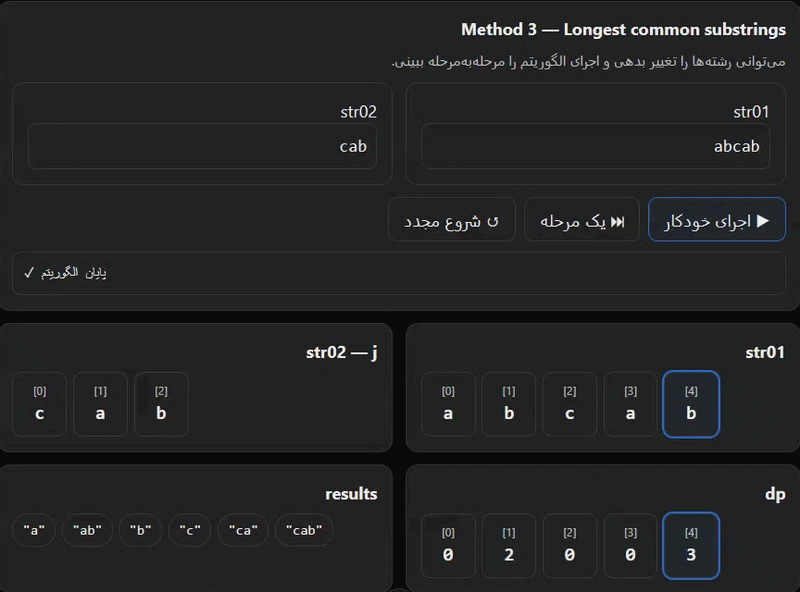

<div align="center">

[🇺🇸 English](../../en/q012/README.md) · [🇮🇷 فارسی](./README.md)

</div>

---

# 🔎 یافتن Substringهای مشترک +  بلندترین Substring مشترک بین دو رشته در C++

<div align="center">
  
</div>
## 📌 صورت مسئله

دو رشته‌ی `str01` و `str02` در اختیار داریم و می‌خواهیم **تمام Substringهای متمایز مشترک** بین آن‌ها را پیدا کنیم.

> واژه **Substring** به یک بخش پیوسته از یک رشته گفته می‌شود. به بیان بهتر جداکردن یک محدوده از یک رشته!

حال در مورد مساله اصلی فرض کنید دو رشته داریم! برای مثال:

```text
str01 = "abcde"
str02 = "xbcde"
```

مجموعه Substringهای مشترک شامل مواردی مانند:

```text
c
d
e
cd
de
cde
```

هستند. اما:

```text
ace
```

جزو Substring محسوب نمی‌شود، چون کاراکترهای آن در رشته‌ی اصلی پیوسته نیستند.

---

## 🧠 ایده‌ی کلی

برای حل این مسئله سه رویکرد اصلی داریم:

1. **تولید تمام Substringها و استفاده از `unordered_set`**
2. **استفاده از Dynamic Programming و ماتریس `n × m`**
3. **استفاده از Dynamic Programming و آرایه یک بعدی جایگزین `n × m`**

روش اول ساده و قابل فهم است، اما برای رشته‌های بزرگ هزینه‌ی زیادی دارد.

روش دوم از رابطه‌ی بین کاراکترهای دو رشته استفاده می‌کند و برای پیدا کردن **Longest Common Substring** بسیار مناسب است.

روش سوم به نوعی روش دوم Optimize شده است و به جای استفاده از یک ماتریس n * m از آرایه ای به طول یکی از دو رشته استفاده می کند! اینکه کدام رشته را برای طول آرایه انتخاب می کنید مهم نیست، چون طول بلندترین رشته مشترک یا طول تمام substringهای مشترک از طول هر دوی این رشته ها کوتاهتر است!

---

# روش اول: `unordered_set`

## 💡 ایده

در روش ساده، ابتدا تمام Substringهای رشته‌ی اول را تولید کرده و داخل یک `unordered_set` قرار می‌دهیم.

سپس تمام Substringهای رشته‌ی دوم را تولید می‌کنیم و بررسی می‌کنیم که آیا در `unordered_set` رشته‌ی اول وجود دارند یا خیر.

ساختار کلی الگوریتم:

```text
str01
  │
  ├── all of substrings
  │
  ▼
unordered_set
  ▲
  │
  ├── substrings of str2
  │
str02
```

---

## 1️⃣ تولید Substringهای رشته‌ی اول

با دو حلقه‌ی تو در تو، تمام بازه‌های ممکن رشته را تولید می‌کنیم:

```cpp
unordered_set<string> str01_substrings;

for (int i = 0; i < str01.size(); i++)
{
    for (int j = i + 1; j <= str01.size(); j++)
    {
        str01_substrings.insert(
            str01.substr(i, j - i)
        );
    }
}
```

در اینجا:

* متغیر `i` نقطه‌ی شروع Substring است.
* متغیر `j` نقطه‌ی پایان بازه است.
* مقدار `j - i` طول Substring است.
* دستور `substr(i, j - i)` خود Substring را تولید می‌کند.
* شی نوع `unordered_set` باعث می‌شود Substringهای تکراری فقط یک بار نگهداری شوند.

---

## 2️⃣ پیدا کردن Substringهای مشترک

حالا تمام Substringهای رشته‌ی دوم را بررسی می‌کنیم:

```cpp
unordered_set<string> results;

for (int i = 0; i < str02.size(); i++)
{
    for (int j = i + 1; j <= str02.size(); j++)
    {
        string sub = str02.substr(i, j - i);

        if (str01_substrings.find(sub) != str01_substrings.end())
        {
            results.insert(sub);
        }
    }
}
```

اگر Substring در مجموعه‌ی رشته‌ی اول وجود داشته باشد، آن را در `results` قرار می‌دهیم.

---

## ⏱️ پیچیدگی روش اول

یک رشته با طول `n` تقریباً:

```text
n × (n + 1) / 2
```

رشته Substring غیرخالی دارد.

بنابراین تعداد Substringها در مرتبه‌ی:

```text
O(n²)
```

است. اما نکته‌ی مهم این است که `substr()` خودش نیازمند ساخت یک `string` جدید است و هزینه‌ی کپی کاراکترها را دارد. برای حل این مساله می توان از string_view هم استفاده کرد! string_view به شما امکان می دهد در یک شی سبک، یک اشاره گر به به یک کاراکتر و یک طول را نگه دارید تا به جای کپی سنگین، از یک شی که به یک نقطه کاراکتر در حافظه اشاره کنید و طولی هم داشته باشید که محدوده شروع یک رشته تا پایان آنرا در دست داشته باشید تا از کپی اضافه و حافظه اضافه و بار پردازشی اضافه جلوگیری کنید!

بنابراین به صورت کلی این روش در عمل برای رشته‌های بزرگ می‌تواند بسیار کند و پرمصرف باشد.

### خلاصه

```text
all of substrings of str1
        ↓
   unordered_set
        ↑
all of substrings of str2
        ↓
common substrings
```

مزیت:

* ساده
* قابل فهم
* مناسب برای پیاده‌سازی اولیه

عیب:

* تولید تعداد زیادی `string`
* مصرف حافظه‌ی زیاد
* هزینه‌ی `substr`
* مناسب نبودن برای ورودی‌های بزرگ

---

# روش دوم: Dynamic Programming با ماتریس `n × m`

اینجا به‌جای تولید مستقیم تمام Substringها، کاراکترهای دو رشته را با یکدیگر مقایسه می‌کنیم.

فرض کنیم:

```text
str01 → طول n
str02 → طول m
```

یک ماتریس با ابعاد زیر می‌سازیم:

```text
n × m
```

هر خانه‌ی ماتریس مشخص می‌کند که **بلندترین Substring مشترکی که در `str01[i]` و `str02[j]` به پایان می‌رسد، چه طولی دارد.**

---

## 🔑 رابطه‌ی اصلی

اگر کاراکتر ایندکس i از رشته اول و کاراکتر ایندکس j از رشته دوم برابر باشد:

```cpp
str01[i] == str02[j]
```

آنگاه:

```cpp
dp[i][j] = dp[i - 1][j - 1] + 1;
```

چرا؟

چون اگر دو کاراکتر فعلی برابر باشند، می‌توانیم Substring مشترک قبلی را که در قطر بالا-چپ قرار دارد، یک کاراکتر ادامه دهیم.

اما اگر:

```cpp
str01[i] != str02[j]
```

باشد:

```cpp
dp[i][j] = 0;
```

چون Substring باید **پیوسته** باشد.

---

## 🔍 یک مثال ساده

فرض کنیم:

```text
str01 = "abc"
str02 = "xbc"
```

اگر دو کاراکتر `b` و `b` را بررسی کنیم و قطر بالا-چپ مقدار `1` داشته باشد:

```text
dp[i][j] = dp[i-1][j-1] + 1
         = 1 + 1
         = 2
```

یعنی تا این نقطه یک Substring مشترک با طول `2` داریم.

---

# 📊 چرا قطر بالا-چپ؟

فرض کنید:

```text
str01 = "abcd"
str02 = "xbcd"
```

وقتی:

```text
c == c
```

باشد، برای اینکه بدانیم آیا `c` ادامه‌ی یک Substring مشترک قبلی است، باید خانه‌ی مورب بالا-چپ را بررسی کنیم.

```text
        x   b   c   d
      ┌────────────────
a     │ 0   0   0   0
b     │ 0   1   0   0
c     │ 0   0   2   0
d     │ 0   0   0   3
```

مقادیر:

```text
1 → طول 1
2 → طول 2
3 → طول 3
```

نشان می‌دهند که یک Substring مشترک پیوسته در حال رشد است.

---

# 🏆 پیدا کردن Longest Common Substring

یکی از کاربردهای اصلی این ماتریس، پیدا کردن **بلندترین Substring مشترک** است.

در هنگام پر کردن ماتریس، بزرگ‌ترین مقدار را نگه می‌داریم:

```cpp
maxLength = max(maxLength, dp[i][j]);
```

در نهایت:

```text
maxLength
```

طول بلندترین Substring مشترک خواهد بود.

برای استخراج خود Substring نیز کافی است محل بزرگ‌ترین مقدار را ذخیره کنیم.

اگر بزرگ‌ترین مقدار در:

```text
dp[i][j]
```

قرار داشته باشد، Substring موردنظر:

```cpp
str01.substr(
    i - maxLength + 1,
    maxLength
);
```

خواهد بود.

---

## ⚠️ یک نکته‌ی بسیار مهم

این الگوریتم در حالت معمول، برای پیدا کردن:

> **Longest Common Substring**

طراحی شده است.

اما اگر هدف ما:

> **تمام Substringهای متمایز مشترک**

باشد، صرفاً ذخیره کردن یک Substring برای هر خانه کافی نیست.

برای مثال اگر مقدار یک خانه:

```text
dp[i][j] = 3
```

باشد، در واقع Substringهایی با طول‌های زیر نیز در آن انتها وجود دارند:

```text
length = 1
length = 2
length = 3
```

بنابراین برای استخراج **تمام Substringهای مشترک** باید تمام این طول‌ها را نیز بررسی کنیم.

---

# 🚀 نسخه‌ی Dynamic Programming برای تمام Substringهای مشترک

در این نسخه، وقتی مقدار یک خانه برابر `length` شد، تمام Substringهایی را که در آن نقطه به پایان می‌رسند استخراج می‌کنیم:

```cpp
unordered_set<string> method2(
    const string& str01,
    const string& str02
)
{
    int n = str01.size();
    int m = str02.size();

    vector<vector<int>> dp(
        n,
        vector<int>(m, 0)
    );

    unordered_set<string> results;

    for (int i = 0; i < n; i++)
    {
        for (int j = 0; j < m; j++)
        {
            if (str01[i] == str02[j])
            {
                if (i == 0 || j == 0)
                    dp[i][j] = 1;
                else
                    dp[i][j] = dp[i - 1][j - 1] + 1;

                int length = dp[i][j];

                // تمام Substringهایی که در str01[i] تمام می‌شوند
                for (int len = 1; len <= length; len++)
                {
                    string sub = str01.substr(
                        i - len + 1,
                        len
                    );

                    results.insert(sub);
                }
            }
        }
    }

    return results;
}
```

در اینجا `unordered_set` همچنان لازم است، چون ممکن است یک Substring مشترک در چند نقطه‌ی مختلف ظاهر شود.

---

# 🧮 پیچیدگی روش Dynamic Programming

ساخت ماتریس:

```text
O(n × m)
```

است.

اما اگر بخواهیم **تمام Substringهای مشترک** را استخراج کنیم، برای هر مقدار `dp[i][j]` ممکن است چندین Substring تولید کنیم.

بنابراین پیچیدگی واقعی استخراج نتایج می‌تواند بیشتر از:

```text
O(n × m)
```

باشد.

این نکته مهم است:

> `O(n × m)` پیچیدگی ساخت DP برای محاسبه‌ی Longest Common Substring است؛ نه لزوماً پیچیدگی استخراج تمام Substringهای مشترک.

---

# 🧠 روش سوم: کاهش مصرف حافظه

در روش قبلی، کل ماتریس را ذخیره کردیم:

```cpp
vector<vector<int>> dp;
```

اما برای محاسبه‌ی طول Substringهای مشترک، هر خانه فقط به **خانه‌ی قطر بالا-چپ** نیاز دارد.

بنابراین می‌توانیم حافظه را کاهش دهیم.

ایده:

```text
ماتریس n × m
       ↓
یک آرایه‌ی یک‌بعدی
```

برای این کار باید ترتیب پیمایش را با دقت انتخاب کنیم.

---

## ⚠️ چرا پیمایش باید از راست به چپ باشد؟

اگر آرایه را از چپ به راست به‌روزرسانی کنیم، ممکن است مقدار:

```text
dp[i - 1]
```

را قبل از استفاده، تغییر داده باشیم.

اما با حرکت از راست به چپ (آخر به اول)، مقدار موردنیاز مربوط به مرحله‌ی قبلی حفظ می‌شود.

---

## پیاده‌سازی

```cpp
unordered_set<string> method3(
    const string& str01,
    const string& str02
)
{
    int n = str01.size();

    vector<int> dp(n, 0);

    unordered_set<string> results;

    for (int j = 0; j < str02.size(); j++)
    {
        for (int i = n - 1; i >= 0; i--)
        {
            if (str01[i] == str02[j])
            {
                if (i == 0)
                    dp[i] = 1;
                else
                    dp[i] = dp[i - 1] + 1;

                int length = dp[i];

                for (int len = 1; len <= length; len++)
                {
                    string sub = str01.substr(
                        i - len + 1,
                        len
                    );

                    results.insert(sub);
                }
            }
            else
            {
                dp[i] = 0;
            }
        }
    }

    return results;
}
```
برای درک بهتر الگریتم سوم، فرض کنید دو رشته زیر را داریم:

```cpp
str1 = "rstABCxyz"
str2 = "ijABCk"
```
پس یک آرایه‌ی عددی به طول رشته‌ی اول، یعنی 9 خانه، با مقدار اولیه‌ی `0` می‌سازیم. سپس یک حلقه از `0` تا طول رشته‌ی دوم حرکت می‌کند و کاراکترهای رشته‌ی دوم را یکی‌یکی بررسی می‌کند. درون این حلقه، حلقه‌ی دیگری تمام خانه‌های رشته‌ی اول را بررسی می‌کند تا مقایسه‌ی کاراکترهای دو رشته انجام شود. نکته‌ی مهم این است که حلقه‌ی داخلی از **آخر به اول** حرکت می‌کند.

در دو رشته‌ی مثال، بلندترین Substring مشترک `ABC` است و سایر کاراکترها ادامه‌ای از یک Substring مشترک نیستند. بنابراین باید تمام Substringهای موجود در `ABC` مانند `A`، `B`، `C`، `AB`، `BC` و `ABC` در `results` قرار بگیرند.

در این ساختار، `j` از `0` تا `5` حرکت می‌کند و با پیمایش رشته‌ی دوم، زمینه‌ی اصلی مقایسه با رشته‌ی اول را فراهم می‌کند. در داخل این حلقه، حلقه‌ی دیگری به تعداد کاراکترهای رشته‌ی اول اجرا می‌شود، اما از آخر به اول.

در ابتدا `j = 0` است! سپس حلقه بیرونی با استفاده از j به کاراکتر A از رشته دوم می رسد! حلقه درونی از آخر رشته اول به اول رشته اول حرکت می کند تا به کاراکتر A برسد. اینجا حلقه بیرونی و حلقه درونی به کاراکتر مشابه A رسیده اند و شرط مساوی برقرار می شود! وقتی حلقه‌ی داخلی به کاراکتر `A` در رشته‌ی اول می‌رسد، چون `A` با کاراکتر فعلی رشته‌ی دوم برابر است و مقدار خانه‌ی قبلی `0` است، مقدار این خانه برابر `0 + 1` یعنی `1` می‌شود. سپس `A` به `results` اضافه می‌شود. حلقه‌ی داخلی ادامه پیدا می‌کند و چون سایر کاراکترها با `A` برابر نیستند، مقدار خانه‌های مربوط به آن‌ها `0` می‌شود.

سپس حلقه‌ی بیرونی یک واحد جلو می‌رود و به `B` می‌رسد. دوباره حلقه‌ی داخلی از آخر به اول حرکت می‌کند تا به `B` در رشته‌ی اول برسد. چون `B` با کاراکتر فعلی رشته‌ی دوم برابر است، مقدار خانه‌ی مربوط به `B` برابر مقدار خانه‌ی قبلی به‌علاوه‌ی `1` می‌شود:

```text
dp[4] = dp[3] + 1
      = 1 + 1
      = 2
```

عدد `2` یعنی تا این نقطه، دو کاراکتر متوالی (`AB`) بین دو رشته مشترک هستند. بنابراین Substringهای `B` و `AB` در `results` قرار می‌گیرند. در ادامه‌ی همین دور، چون کاراکتر `A` با `B` برابر نیست، مقدار خانه‌ی `A` که قبلا 1 شده بود، اینک به `0` برمی‌گردد.

در واقع این روش، ماتریس کامل روش دوم را ذخیره نمی‌کند؛ بلکه فقط اطلاعات موردنیاز از مرحله‌ی قبل را در همین آرایه‌ی یک‌ بعدی نگه می‌دارد و محاسبات مرحله‌ی جدید را روی همان آرایه انجام می‌دهد.

سپس حلقه‌ی بیرونی یک واحد دیگر جلو می‌رود و به `C` می‌رسد. حلقه‌ی داخلی دوباره از آخر به اول حرکت می‌کند تا به `C` در رشته‌ی اول برسد. چون `C` با کاراکتر فعلی رشته‌ی دوم برابر است، مقدار خانه‌ی مربوط به آن برابر مقدار خانه‌ی قبلی به‌علاوه‌ی `1` می‌شود:

```text
dp[5] = dp[4] + 1
      = 2 + 1
      = 3
```

عدد `3` نشان می‌دهد که در این نقطه، سه کاراکتر متوالی `ABC` بین دو رشته مشترک هستند. بنابراین تمام Substringهایی که در این مرحله به دست می‌آیند، یعنی `C`، `BC` و `ABC`، در `results` قرار می‌گیرند. حال خانه مربوط به کاراکتر B که قبلا 2 شده بود برابر 0 می شود!

پس در این مثال، روند تشکیل Substring مشترک به شکل زیر است:

```text
A       → 1
AB      → 2
ABC     → 3
```

و از هر مرحله، تمام Substringهای ممکن استخراج می‌شوند:

```text
A
B
AB
C
BC
ABC
```

در ادامه‌ی الگوریتم، هیچ Substring مشترک جدیدی پیدا نمی‌شود.

بنابراین می‌توان گفت در هر مرحله از پیمایش رشته‌ی دوم، تمام کاراکترهای مشابه آن در رشته‌ی اول پیدا می‌شوند. اگر کاراکتر فعلی با کاراکتر رشته‌ی دوم برابر باشد، مقدار خانه‌ی آن از مقدار خانه‌ی قبلی به‌علاوه‌ی `1` به دست می‌آید. سپس بر اساس مقدار جدید، تمام Substringهای مشترکی که در این نقطه به پایان می‌رسند، استخراج می شوند و در `results` ذخیره می‌شوند.

اگر Substring مشترک `ABC` باشد، در مراحل مختلف حلقه‌ی اصلی به‌صورت خودکار Substringهای زیر کشف می‌شوند:

```text
A
B
AB
```

و وظیفه‌ی ادامه‌ی حلقه‌ها در مرحله‌ی `C`، کشف و ثبت Substringهای زیر است:

```text
C
BC
ABC
```

---

# 💾 مقایسه‌ی مصرف حافظه

روش ماتریسی:

```text
O(n × m)
```

روش آرایه‌ای:

```text
O(n)
```

یا در صورت انتخاب جهت دیگر پیمایش:

```text
O(min(n, m))
```

بنابراین وقتی طول رشته‌ها زیاد باشد، کاهش حافظه می‌تواند اهمیت زیادی داشته باشد.

# 🔬 پیاده‌سازی کامل با string_view برای سرعت بالاتر:

```cpp
#include <iostream>
#include <vector>
#include <string>
#include <string_view>
#include <unordered_set>

using namespace std;


// ============================================================
// Convert string_views to strings
// ============================================================

unordered_set<string> toStrings(
    const unordered_set<string_view>& views
)
{
    unordered_set<string> results;

    for (string_view view : views)
        results.emplace(view);

    return results;
}


// ============================================================
// Method 1
// Generate all substrings + unordered_set
// ============================================================

unordered_set<string> method1(
    string_view str01,
    string_view str02
)
{
    unordered_set<string_view> str01_substrings;
    unordered_set<string_view> results;

    // Generate all substrings of the first string
    for (size_t i = 0; i < str01.size(); i++)
    {
        for (size_t j = i + 1; j <= str01.size(); j++)
        {
            str01_substrings.emplace(
                str01.data() + i,
                j - i
            );
        }
    }

    // Check all substrings of the second string
    for (size_t i = 0; i < str02.size(); i++)
    {
        for (size_t j = i + 1; j <= str02.size(); j++)
        {
            string_view sub(
                str02.data() + i,
                j - i
            );

            if (str01_substrings.find(sub)
                != str01_substrings.end())
            {
                results.emplace(sub);
            }
        }
    }

    return toStrings(results);
}


// ============================================================
// Method 2
// Dynamic Programming + Matrix
// ============================================================

unordered_set<string> method2(
    string_view str01,
    string_view str02
)
{
    int n = str01.size();
    int m = str02.size();

    vector<vector<int>> dp(
        n,
        vector<int>(m, 0)
    );

    unordered_set<string_view> results;

    for (int i = 0; i < n; i++)
    {
        for (int j = 0; j < m; j++)
        {
            if (str01[i] == str02[j])
            {
                if (i == 0 || j == 0)
                    dp[i][j] = 1;
                else
                    dp[i][j] =
                        dp[i - 1][j - 1] + 1;

                int length = dp[i][j];

                // Extract all substrings
                // ending at this position
                for (int len = 1;
                     len <= length;
                     len++)
                {
                    results.emplace(
                        str01.data() + i - len + 1,
                        len
                    );
                }
            }
        }
    }

    return toStrings(results);
}


// ============================================================
// Method 3
// Dynamic Programming with a One-Dimensional Array
// ============================================================

unordered_set<string> method3(
    string_view str01,
    string_view str02
)
{
    int n = str01.size();

    vector<int> dp(n, 0);

    unordered_set<string_view> results;

    for (size_t j = 0; j < str02.size(); j++)
    {
        // Moving from right to left is essential
        for (int i = n - 1; i >= 0; i--)
        {
            if (str01[i] == str02[j])
            {
                if (i == 0)
                    dp[i] = 1;
                else
                    dp[i] = dp[i - 1] + 1;

                int length = dp[i];

                // Extract all substrings
                // ending at this position
                for (int len = 1;
                     len <= length;
                     len++)
                {
                    results.emplace(
                        str01.data() + i - len + 1,
                        len
                    );
                }
            }
            else
            {
                dp[i] = 0;
            }
        }
    }

    return toStrings(results);
}


// ============================================================
// Print Results
// ============================================================

void printResults(
    const unordered_set<string>& results
)
{
    for (const string& sub : results)
    {
        cout << sub << '\n';
    }
}


// ============================================================
// MAIN
// ============================================================

int main()
{
    string str01 = "abcde";
    string str02 = "xbcde";


    // --------------------------------------------------------
    // Method 1
    // --------------------------------------------------------

    // auto result1 = method1(str01, str02);
    // printResults(result1);


    // --------------------------------------------------------
    // Method 2
    // --------------------------------------------------------

    // auto result2 = method2(str01, str02);
    // printResults(result2);


    // --------------------------------------------------------
    // Method 3
    // --------------------------------------------------------

    auto result3 = method3(
        str01,
        str02
    );

    printResults(result3);

    return 0;
}
```

---

# 🎯 جمع‌بندی

سه ایده‌ی اصلی این مسئله:

### 1. روش ساده

```text
Generate → Hash Set → Search
```

تمام Substringها را تولید می‌کنیم و با `unordered_set` به دنبال تطابق می‌گردیم.

### 2. Dynamic Programming

```text
Character Comparison
        ↓
    DP Matrix
        ↓
Common Substrings
```

با مقایسه‌ی کاراکترها و استفاده از مقدار قطر بالا-چپ، طول Substringهای مشترک را محاسبه می‌کنیم.

### 3. کاهش حافظه

```text
O(n × m)
     ↓
  O(n)
```

با استفاده از یک آرایه‌ی یک‌بعدی، نیازی به نگهداری کل ماتریس نداریم.

---

## ⭐ نکته‌ی کلیدی

تفاوت این دو مسئله را همیشه در نظر داشته باشید:

```text
Common Substring
        ≠
Longest Common Substring
```

روش استاندارد DP با رابطه‌ی:

```cpp
dp[i][j] =
    dp[i - 1][j - 1] + 1
```

به‌طور مستقیم برای **Longest Common Substring** بسیار مناسب است.

اما اگر هدف **تمام Substringهای متمایز مشترک** باشد، باید علاوه بر DP، تمام طول‌های ممکن را از هر مقدار `dp[i][j]` استخراج کنیم.

---

## 📌 انیمیشن نمایش روش سوم
<div align="center">
  
</div>

---

## 🤝 مشارکت ها

<div align="center">

| GitHub | LinkedIn | Email | Site | Telegram |
|--------|----------|-------|------|----------|
| [HadiAbbasi](https://github.com/HadiAbbasi) | [Hadi Abbasi](https://www.linkedin.com/in/hadi-abbasi-programmer/) | [Hadi Abbasi](hadi.abbasi.programmer@gmail.com) | [Hiens.org](https://hiens.org) | [Hadi Abbasi](@Hadi_Abbasi_Programmer) |

</div>
